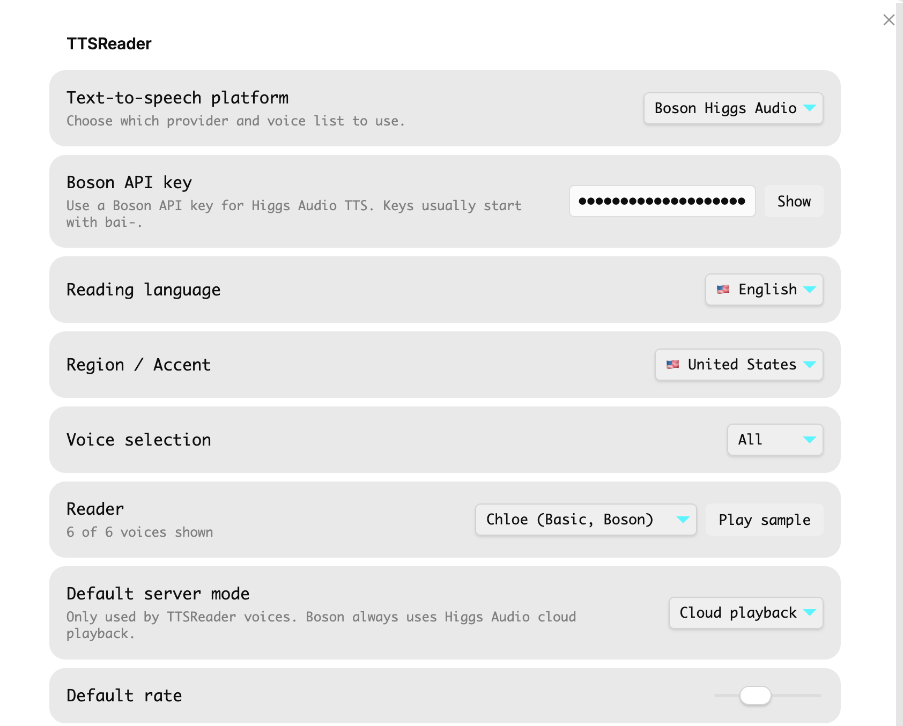
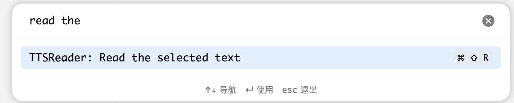

# TTSReader for Obsidian

TTSReader reads your Obsidian notes aloud. It can read selected text, the current note, or text you paste into the reader window.

[中文文档](docs/README.zh-CN.md)

## What It Does

- Read selected text from the editor.
- Read the current note when no text is selected.
- Add `Read the selected text` to the command palette and editor right-click menu.
- Choose a voice by platform, language, region/accent, and Basic/Premium filter.
- Play a voice sample before reading.
- Show playback state and visible error messages in the Obsidian status bar.
- Cache recently generated audio so repeated playback does not always call the API again.

## Voice Platforms

### Boson Higgs Audio

Boson Higgs Audio is the default platform for new installs.

Use it if you want cloud TTS with the bundled Boson preset voices:

- Berlinda
- Chloe
- Eleanor
- Jake
- Marcus
- Nora
- Oliver

You need a Boson API key. Open the plugin settings, choose `Boson Higgs Audio`, paste your key into `Boson API key`, or use the `Guide` button to open the Boson API key page.

Boson currently returns audio even for unknown `voice` values, so a successful response does not always prove the selected voice id was recognized. If a preset voice sounds inconsistent, try `Berlinda`, which is the voice id used in Boson's official curl example.

### TTSReader

TTSReader provides browser voices and TTSReader server voices.

Use it if you want:

- Browser/Web Speech voices exposed by the current Obsidian desktop runtime.
- TTSReader server voices.
- TTSReader authenticated playback with a UAPI key, Bearer token, or Firebase refresh credentials.

The plugin does not enforce TTSReader Premium quota locally. If a voice is unavailable or a quota is exceeded, the TTSReader API response will decide and the plugin will show the error.

## Installation

### Install From GitHub Releases

1. Open the latest release: <https://github.com/sundy-li/obsidian-ttsreader/releases/latest>
2. Download these three files:
   - `main.js`
   - `manifest.json`
   - `styles.css`
3. In your Obsidian vault, create this folder:

   ```text
   <your vault>/.obsidian/plugins/ttsreader/
   ```

4. Put the three downloaded files into that folder.
5. Restart Obsidian.
6. Open `Settings` -> `Community plugins`.
7. Enable `TTSReader`.

## Quick Start

1. Open `Settings` -> `TTSReader`.
2. Choose a text-to-speech platform.
3. Add the required API key or credentials for that platform.
4. Choose a reader voice.
5. Select text in a note.
6. Run `Read the selected text` from the command palette or editor right-click menu.

You can also click the ribbon icon or run `Open TTSReader` to open a reader window with a text box, platform selector, voice selector, sample button, and playback controls.

## Settings Page

The settings page keeps provider-specific credentials together with voice controls. When you choose `Boson Higgs Audio`, the page shows only the Boson API key field, then lets you pick language, region/accent, voice filter, reader voice, server mode, and default rate.



Use `Play sample` beside the reader selector to confirm the voice before using it on your notes.

## Command Palette

Run `TTSReader: Read the selected text` from the command palette to speak the current editor selection. The command includes the default shortcut `Mod+Shift+R`, shown as `Cmd+Shift+R` on macOS and `Ctrl+Shift+R` on Windows/Linux.



## Configure Boson

1. Open `Settings` -> `TTSReader`.
2. Set `Text-to-speech platform` to `Boson Higgs Audio`.
3. Paste your Boson API key into `Boson API key`.
4. Click `Show` if you need to verify the pasted value.
5. Click `Guide` if you need to open the Boson API key page.
6. Choose a reader voice.

Boson keys usually start with `bai-`.

## Configure TTSReader

1. Open `Settings` -> `TTSReader`.
2. Set `Text-to-speech platform` to `TTSReader`.
3. Choose one authentication method:
   - `Authorization / UAPI Key`: paste a `UAPI-...` key or a short-lived `Bearer eyJ...` token.
   - `Firebase API key` plus `Firebase refresh token`: lets the plugin refresh short-lived cloud playback tokens automatically.
4. Choose a reader voice.

For Firebase credential extraction, see [Firebase credentials](docs/firebase-credentials.md).

Treat Bearer tokens, Firebase refresh tokens, UAPI keys, and Boson API keys like passwords.

## Voice List Notes

The Basic voice list means “voices that this Obsidian desktop runtime can actually play.”

Some Basic voices shown on the TTSReader website are provided by the browser. Obsidian runs inside Electron, so voices such as Aria, Michelle, or Jenny may not appear unless Electron exposes them through `speechSynthesis.getVoices()`.

Boson voices are bundled as preset cloud voices and do not depend on the browser voice list.

## Commands

- `Open TTSReader`: open the reader window.
- `Read the selected text`: read the currently selected editor text.
- `Speak selection or current note`: read selected text, or the current note if nothing is selected.
- `Stop TTSReader playback`: stop current playback.

## Troubleshooting

### Nothing Plays

- Check that the selected platform has the right credential configured.
- Try `Play sample` for the selected voice.
- Watch the Obsidian status bar or plugin notice for an error message.
- For Boson, confirm your API key starts with `bai-`.
- For TTSReader server voices, confirm you have a valid UAPI key, Bearer token, or Firebase refresh credentials.

### The TTSReader Website Shows a Voice That the Plugin Does Not Show

That voice may be a browser-provided voice available in Chrome, Edge, or Safari, but not available in Obsidian/Electron. The plugin only lists browser voices that Obsidian can actually play.

### TTSReader Authorization Expires

Short-lived Bearer tokens expire quickly. Use `Firebase API key` plus `Firebase refresh token` if you want the plugin to refresh cloud playback authorization automatically.

### Premium Voice Fails

The plugin no longer blocks Premium usage locally. If the account, voice, or quota is not allowed, the API response will be shown as an error.

## Privacy And Credentials

Credentials are stored in this plugin's Obsidian plugin data. Anyone who can read your vault configuration files may be able to read those credentials. Do not publish your vault's `.obsidian/plugins/ttsreader/data.json`.

The plugin sends text to the selected cloud provider when using Boson Higgs Audio or TTSReader server voices. Browser voices are handled by the local Web Speech runtime exposed by Obsidian.

## License

MIT
